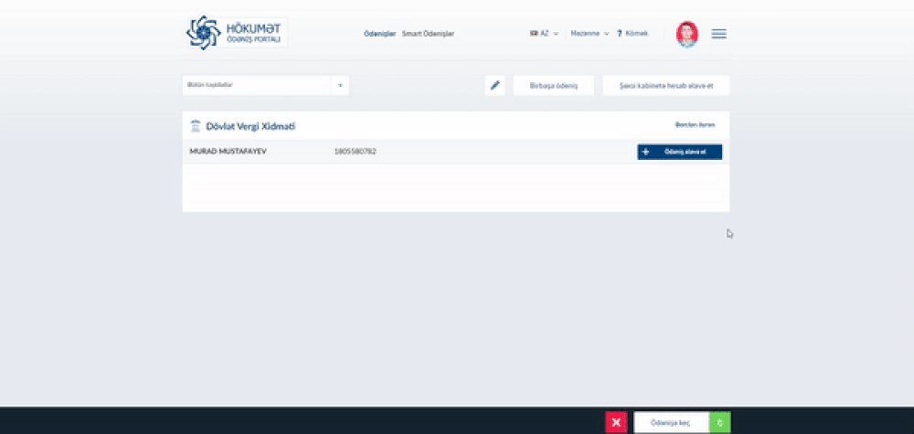

# Remote xariclə işləyən camaatın ən çox verdiyi suallara cavablar.(Əgər sualınıza cavab tapa bilmədinizsə, issue açın - cavablandıraq)

## 0
* Sual: Deyilənə görə ümumi ardıcıllıq aşağıdakı suallara cavablardan aydın olmur. Çox gözəl o zaman bir də belə yazıram.
* Cavab:
1. İlk öncə VÖEN açmaq lazımdır.
2. Daha sonra bankda dublikat hesab.
3. Bütün bu məlumatları verirsiniz xaricdəki şirkətə(yəni VÖEN və bank rekvizitlərinizi və əlavə nə istəsələr onu).
4. Daha sonra xaricdəki şirkət sizə müqavilə göndərəcək, hansı ki, yuxarıda onlara verdiyiniz məlumatlar öz əksini tapacaq.
5. Müqaviləni imzaladıqdan sonra, işə başlayırsınız, işləyirsiniz və şirkət sizə işlədiyiniz üçün pul verəcək(təbii olaraq).
6. Şirkət pulu göndərəndə yəqin ki, sizə bildirəcək ki, pul onlar tərəfindən sizə göndərilib - bu zaman online banking app vasitəsilə bank hesabınızı yoxlayın.
7. Əgər pul gəlibsə, şəxsiyyət vəsiqənizlə bankınıza yaxınlaşın. 3 iş günü ərzində hesabda pul görsənmirsə, bankınızla əlaqəyə keçin - soruşun ki, pul hanı?
8. Pulu kassadan sayaraq götürün.
9. Pulu xərcləyin və ya yığın.

## 1
* Sual: Biz vergi ödəməliyik?
* Cavab:
Təbii ki. Yeni vergi məcəlləsinə əsasən, remote xariclə işləyən şəxslər *Gəlir* vergisi ödəyicisidirlər(əvvəl sadələşmiş vergi ödəyicisi idik). Bizim adımız *mikro-sahibkar* olaraq sıralanır.

## 2
* Sual: Necə vergi ödəyicisi oluruq?
* Cavab:
ASAN xidmətdə 3 iş günü ərzində sizi təntənəli surətdə vergi ödəyicisi edirlər. e-taxes.gov.az üçün login\parol da verilir ki, işlərinizi online apara biləsiniz.

## 3
* Sual: Xaricdən vəsaiti necə qəbul edirik?
* Cavab:
Xaricdən ödəniş qəbul etmək üçün, siz bankda dublikat hesab açmalı və həmin hesab nömrəsini ödənişi göndərən şəxsə, şirkətə verməlisiniz.

Dublikat hesab üçün şəhadətnaməni, elektron qaydada, banka getmədən, e-taxes.gov.az-dan bank filianızı seçib göndərmək olur.
Əgər siz ödənişi dollarla qəbul edəcəksinizsə, o zaman AZN və Dollar hesabı üçün ərizə göndərin. Əgər daha sonra euro qazansanız, bir səhadətnamə də ona lazımdır vəssalam.
3 iş günü ərzində həmin seçdiyiniz, bank filialına yaxınlaşıb, sənədlərə qol çəkdikdən sonra sizin artıq sahibkar hesabınız olacaq.
Dublikat hesab, bankda sahibkar hesabıdır, yəni adi bank hesabıdır.
Bu prosedurun video izahına baxa bilərsiniz: [Youtube](https://www.youtube.com/watch?v=PdK70CRw4H0)

## 4
* Sual: Vergi dövrü, təqvimi nədir və ya haçan vergi ödəməliyəm?
* Cavab:
Hər ildə 4 rüb var, hər rübün sonunda vergi ödəməliyik.
Yəni Yanvar, Fevral və Mart ayında ödənişləri qəbul etdikdən sonra Aprel-in 15-ə qədər bəyənnaməni təqdim edib, vergini də ödəmək lazımdır.
Aprel ayında daxil olan ödənişlər növbəti hesabat dövrünə düşür(Aprel, May, İyun - dolayısı ilə İyulda hesabat vermək lazımdır).

## 5 
* Sual: Hesabat necə doldurulur?
* Cavab:
Hesabat da online qaydada doldurulur. Doldurulma qaydası Vergi xidmətinin saytında, youtube-da və.s yerlərdə var. Google-da axtarın.

## 6
* Sual: Vergi necə hesablanır?
* Cavab:
Mikro-sahibkarlar, vergi güzəştləri səbəbilə aylıq ödənişdən 5% vergi ödəməlidirlər. 
Hər nağdlaşdırılan ödənişdən 1% və bankdan asılı olaraq 0.6% bank komissiyası tutulur.
Dolayısı ilə maksimal 6.6% hər ay gedə bilər :) Nağdlaşdırmayıb, hesaba bağlı kartdan istifadə etsəniz 1%-dən yaxa qurtarmaq olar.

## 7
* Sual: Yox eee indi nətər hesablanır vergi?
* Cavab:

Xüsusi əziyyət çəkənlərçün izahlı lüğət:
Elə təsəvvür edin ki, Yanvar, Fevral və Mart ayları üzrə sizə hər ay 1000$ ödəniş gəlib. 
Ödənişin daxil olduğu gün üçün məzənnəmiz müvafiq olaraq olub: 1.69, 1.70 və 1.68
Dolayısı ilə banka daxil olan vəsait 1690 + 1700 + 1680 AZN olub.

Yanvar -> 1690

Fevral -> 1700

Mart -> 1690

DSMF ödənişləri elə təsəvvür edək ki, 50 AZN aylıqdır(özünüz dəqiqləşdirin bu məbləği) və dolayısı ilə 3 aya 150 AZN DSMF ödənişidir.

Bank xərcləri: 1690x0.6/100 + 1700x0.6/100 + 1680x0.6/100 = 30.42 AZN.

Xərcləri də qeyd edirik: 150 + 30.42 = 180.42 AZN.

Yekun vergi məbləği: ((1690 + 1700 + 1690) - 180.42) * 0.05 = 244.979 AZN.

Nağdlaşdırma vergisi məbləği, hər 3 ay nağdlaşdırsaq (bu məbləğin hesabata dəxli yoxdur, göstərilmir orda nə də xərc kimi göstərilə bilmir):

1690x1/100 + 1700x1/100 + 1680x1/100 = 50.7 AZN.

## 8
* Sual: Azərbaycandan xaricdə yaşayaraq remote işləyib, Azərbaycandaki hesaba ödəmə almaq mümkündürmü?
* Cavab:
https://github.com/ShahriyarR/remote-work-questions/issues/1#issuecomment-818810787

## 9
* Sual: Bank hesabından nağdlaşdırmaya limit varmı?
* Cavab:
Səhv etmirəmsə, 15000 AZN aylıq limit var.

## 10
* Sual: Payoneer kart ilə vergi ödəyicisi olmaq arasındakı fərqlər varmı?
* Cavab:
Hörmətli vergi ödəyicisi olmağın bir sıra üstünlükləri var:

    DSMF ödənişi olduğu üçün qocalanda pensiya söhbəti gedir :)))
    Ipoteka götürəndə 2 il ərzində bank hesabına daxil olan vesait ve hemcinin 2 il erzinde odediyiniz vergiler teleb olunur. Bunlar yerinde olsa Ipoteka almaq her hansi problem ola bilmez. Eyni hadise kredit goturende de bash verir - heyatdi bilmek olmur bir de gordun lazim oldu.
    Medaxili, mexarici, borcu-xerci hesablamaq daha rahatdi, bash da az yorulur, engineer olaraq tenbel adamam men 5%-i tutun bashim sakit olsun mentiqi ile gedirem.

Paynoneer kart men 2015-de istifade etmeye calishmisham onda da bele bir problem olmushdu ki, bir defeye yalniz 300$ cixartmaq olurdu, her defe cixardanda 1.5%-2% tuturdu + nese elave de bir fee var idi. Odur ki, imtina etmishdim, yani hesab kitab edende serf etmemishdi, cunki o vaxti remote ishleyenler sadeleshdirilmish vergi odeyicisi gedirdi ve o da rayonda 2% bakida 4% idi.
Bashqa her hansi payoneer-e qarshi arqumentim yoxdur. Belke kimse daha yaxshi biler ama menim tecrubemde bele idi.

## 11
* Sual: Dublikat hesab açılarkən o hesaba bağlı olan bank kartı avtomatik olaraq təqdim olunur?
* Cavab:
Dublikat hesab acarken secdiyiniz banki duzgun arashdirmaq lazimdir.
Adeten Sahibkar paketi deye bir sheyler olur ve ola bilir. Gerek bankdan sorushasiniz.
Sahibkar hesabina bagli bank kartinda atm-den cekme qaydasi ferqli ola biler onu da gerek deqiqleshdiresiniz.
Online nagdsiz ishler ucun ise idealdir.
Xaricde gedib yashayanda meselen, 3 ay Turkiyede falan hansisa turistik yerde ishleyende odenish gelende bu kartla yashamaq olur :)

## 12
* Sual: "Rezidentlik  Sertifikatı" nədir?
* Cavab:
Bəzi şirkətlər ikili vergi tutulmaması üçün sizdən "Rezidentlik  Sertifikatı" tələb edə bilir (sizə ödənilən məbləğə görə şirkət vergi ödəməməsi üçün). Azərbaycan Respublikası ilə digər dövlətlər arasında bağlanmış ikiqat vergitutmanın aradan qaldırılması haqqında beynəlxalq müqavilələyə əsasən sizə Rezidentlik Sertifikatini yenədə Vergi xidməti  təqdim edir. Bunun üçün online şəkildə DTA-01 ərizəsi  təqdim edirsiz. Əlavə olaraq bağladığınız müqaviləni  təqdim  etməlisiz. Hansı dövlətlərlə müqaviləmizin olmasını Verginin internet səhifəsindən tapmaq mümkündür. Rezidentlik Sertifikati illik verilir. 


## 13
* Sual: Dublikat hesab ucun bank seçiminin güclü bir önəmi var yoxsa fərq eləmir? Fərg edirsə hansi bankdan hesab açmaq daha əlverişlidir?
* Cavab:
Sözün düzünü desək, bizim bankların inkişaf tempi, 21-ci əsr tələblərinə cavab verməsi, müştəri xidməti, mobil banking imkanları ancaq xoş arzularla bağlıdır :)
Odur ki, mənimçün bankların heç bir fərqi yoxdur. Onsuz da bir iş üçün lazım olacaq ki, ödənişi qəbul edə biləsiniz vəssalam.

## 14
* Sual: Payoneer bank hesabı ilə Payoneer kart arasında fərq nədir?
* Cavab: Biri kartdır, digəri isə bank hesabı.
Əgər sizin Payoneer bank hesabınız varsa, bu zaman xaricdən ödənişi ilk öncə o hesaba transfer edib, daha sonra da o hesabdan istədiyiniz məbləği yerli bank hesabınıza yönləndirə bilərsiniz. Hər hansı bank fee-dən burda xəbərim yoxdur. Lakin sizə lazım olan qədər pulu göndərmək bir üstünlük sayıla bilər.
Yəni, Payoneer hesabınızda 5000$ toplanırsa, onu istədiyiniz hesablara artıq özünüz göndərirsiniz, çalışdığınız şirkət yox.
Payoneer kart isə yuxarıda qeyd etmişəm, mənə qatışıq gələn baş ağrısıdır.

## 15
* Sual: Salam, adıma bir neçə full+part time müqavilə var iş yeri Azərbaycan olmaq üzrə, xaricdən yeni part time remote iş görürsəm bu problem olmaz ki?
* Cavab:
Xarici remote iş təklif edən şirkətlərin 99%-i yalnızca onlar üçün full-time çalışmağınızı tələb edir. Yani part-time təklif edənlərini mən görməmişəm.
Təbii ki, sonradan üstü açılsa ki, eyni anda bir neçə şirkət üçün çalışırsınız bu imzalanan kontraktın qaydalarının pozulması deməkdir. Düşünmürəm ki, xarici şirkət əziyyət çəkib sizi məhkəməyə verəcək amma ki, həmin şirkət yəqin ki, sizdən sonra bütün azərbaycanlıları işə götürməyəcək. Ümumiyyətlə bu kimi işlərdə çox diqqətli, disiplinli və etibarlı olmaq lazımdır ki, sonradan kimisə refer etdikdə həmin azərbaycanlı da işə girə bilsin, iş sahibi olsun. Bu işin mənəvi və hüquqi tərəfi.
O ki qaldı deyək ki, eyni anda 3 iş görüb çatdıranlara şəxsən mən həsəd aparıram :) Özüm heç vaxt eyni anda 1 işdən artıq işdə çalışmamışam, sadəcə nə enerjim qalır nə də həvəsim.
Vergi Xidməti üçün isə bu lap əladır, daha artıq qazanırsınız, deməli daha artıq vergi verirsiniz.

## 16
* Sual: ASAN imzaya gərək varmı?
* Cavab:
Məndə yoxdur. Səbəbi çox sadədir - login\parolla daxil olmaq olur e-taxes.gov.az-a və bütün işləri də görmək olur.

## 17
* Sual: e-qaimə falan bizə aiddirmi?
* Cavab:
Xeyr.

## 18
* Sual:
Salam. DSMF və Siğorta ödənişlərini hara və necə ödəmək lazımdı? Online ödəmək mümkündü? Mümkün olduğu halda, hansı məlumatlar (voen, istifadeci və s) lazımdı ödənişi düzgün yerinə yetirmək ücün? Ümumi olaraq borcumun olmağını, varsada nəgədər ödəniş etməli oldugumu gorə biləcəyim bir platforma var?

* Cavab:
GPP.az-dan odenish edirik butun borclari.
"Shexsi hesab vereqesi"-de en axirda vergi borcu gorsenir.
GPP.az-dan borc odeyerken:
111130 - Fiziki shexslerin diger gelirlerinden gelir vergisi

DSMF borcu odeyerken:
Muzdla işləməyənlərin fərdi sahibkarlıq fəaliyyəti üzrə ödənilən sosial ayırmalar:
121380 - Digər sahələrdə sahibkarlıq fəaliyyəti ilə məşğul olan fiziki şəxslər üzrə ödənilən sosial ayırmalar

Icbari de hemcinin orda qeyd olunur Diger sahelerde bla bla bla

## 19

* Sual:
Hökumət ödəniş portalında, müvafiq təsnifat kodunu seçəndən sonra mənim DSMF borcum görsənirmi? Yəni orda 0 (sıfır) AZN yazılıbsa,
o deməkdi ki, mənim borcum yoxdu?

* Cavab:
Xeyr. GPG.az-da sizin borclar görünmür,borcunuzu öyrənmək üçün şəxsi hesab vərəqənizə baxmalısınız.

## 20

* Sual:
Yaxşı bəs şəxsi hesab vərəqəsinə hardan baxaq?

* Cavab:
[e-taxes.gov.az](https://login.e-taxes.gov.az/login/) saytında daxil olduqda, Bölmə olaraq *E-bəyannamə, ƏDV-DH və ŞHV* seçin,
açılan pəncərədən *Məlumat axtar*  dropdownundan *Şəxsi hesab vərəqəsi* seçin və orda da açılan pəncərədə tarix aralığına görə axtarış edin.
Axtarış nəticələri seçdiyiniz tarix aralığına görə vergi, DSMF, sığorta, nəyi ödəmisiniz nəyi ödəməmisiniz, nə qədər borcunuz var, nə qədər faiz gəlib
hamısını göstərəcək.

Borcunuza gələn faizləri də görmək istəyirsinizsə, axtarış edəndə *Çap  kriteriyası* selectindən *Faiz hesablanması məqsədləri üçün* seçin.

## 21
* Sual:
DSMF və icbari sığorta məbləği nə qədərdir? 

* Cavab:

Ən dəqiqini 195 bilir amma yeni vergi qanuna edilən dəyişikliyə əsasən,

DSMF: 86,25 AZN
İcbari tibbi sığorta isə: 13,80 AZN olub.


## 22
* Sual:
Vergi borcunu ödəmək üçün hesabda borc qədər pul saxlamalıyam, ya sonra istənilən kartla ödəmək olur?

* Cavab:
Hesabda pul saxlamağa ehtiyac yoxdur, istənilən kartla gpp.az-dan ödəmək olur vergi borcunur. 18-ci suala baxın.

## 23
* Sual:
Hesabat dövründə heç bir ödəniş qəbul etməmişəm, yenə də DSMF+sığorta ödəməliyəm?

* Cavab:
Xeyr, yalnız ödəniş aldığınız ay üçün vergi, dsmf, sığorta ödəyirsiniz. Niyə? Çünki pul yoxdursa, borc da yoxdur.

## 24
* Sual:
2 iş yerim var xaricdə. 3 hesabım var (EUR, USD, AZN(bank əməliyyatları üçün lazım olur dedilər)). 1 ay ərzində 2 hesabıma ödəniş olunubsa 2x(DSMF + İcbari tibbi siğorta) ödənilməlidir? və ya rüblük hesabat hər hesabəm üçün ayrıca verilir?

* Cavab:
Xeyr, sadəcə 1 dsmf ödənişi ve 1 icbari ödənişi lazımdır. Hər hesab üçün ayrıca verilmir.


## 25
* Hökumət ödəniş portalından ödəniş edərkən təsnifat kodlarının avtomatlaşdırılma [videosu linki](https://github.com/muradmustafayev/remote-work-questions/blob/main/video.mp4?raw=true)



* videoda istifadə olunan kod

```javascript
const specificTexts = ["111111", "121112", "125300", "127300", "124110"];

$("#servicesModal .list li").addClass("active").find("label").each((_, label) => {
  const $label = $(label);
  specificTexts.some(text => $label.text().includes(text) && $label.css("background-color", "red").find("input").prop("checked", true));
});
```

## 26
* Sual:
VÖEN-imə bağlı vergi borcumu avtomatlaşdırılmış şəkildə necə öyrənə bilərəm?

* Cavab:
Daxili API istifadə edən shell skript yaza bilərsiniz:

```sh
VOEN=0123456789
curl -s \
  -X POST \
  -H 'Content-Type: application/json' \
  -d '{"METHOD": "wsEbynGetDebetSum", "voen": "$VOEN"}' https://www.e-taxes.gov.az/controller \
| jq .RESULT.debet
```

Daha çox məlumat üçün bax: [vergiBorcu.js](https://www.e-taxes.gov.az/ebyn/js/vergiBorcu.js)
